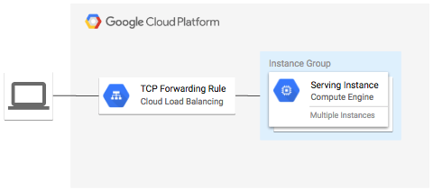
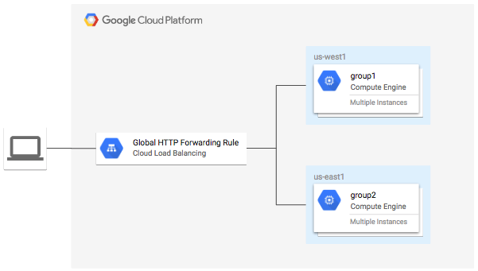
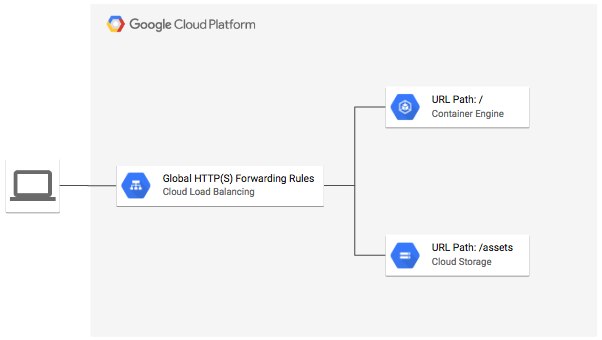
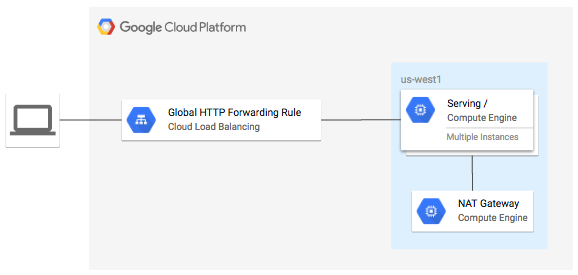
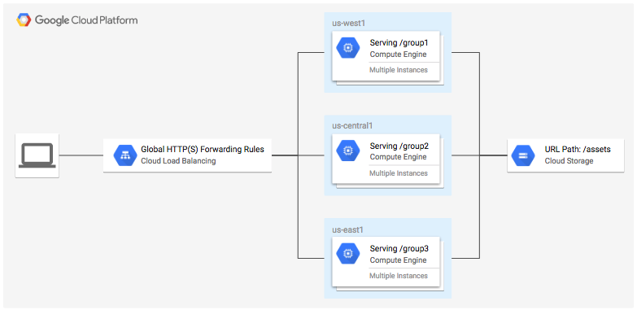
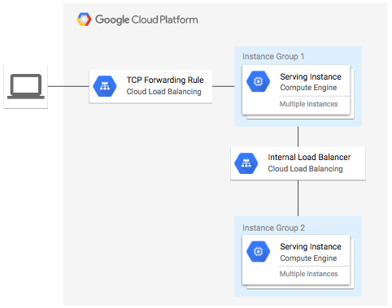

# Google Cloud Platform Terraform module examples

Collection of examples for using Terraform with Google Cloud Platform.

## [example-lb](./example-lb)

**Figure 1.** *example-lb diagram*

</img>

Modules used:

- [terraform-google-managed-instance-group](https://github.com/danisla/terraform-google-managed-instance-group)
- [terraform-google-lb](https://github.com/danisla/terraform-google-lb)

## [example-lb-http](./example-lb-http)

**Figure 1.** *example-lb-http diagram*

</img>

Modules used:

- [terraform-google-managed-instance-group](https://github.com/danisla/terraform-google-managed-instance-group)
- [terraform-google-lb-http](https://github.com/danisla/terraform-google-lb-http)

## [example-lb-http-gke](./example-lb-http-gke)

**Figure 1.** *example-lb-http-gke diagram*

</img>

Modules used:

- [terraform-google-lb-http](https://github.com/danisla/terraform-google-lb-http)

## [example-lb-http-nat-gateway](./example-lb-http-nat-gateway)

**Figure 1.** *example-lb-http-nat-gateway diagram*

</img>

Modules used:

- [terraform-google-managed-instance-group](https://github.com/danisla/terraform-google-managed-instance-group)
- [terraform-google-lb-http](https://github.com/danisla/terraform-google-lb-http)

## [example-lb-https-content](./example-lb-https-content)

**Figure 1.** *example-lb-https-content diagram*

</img>

Modules used:

- [terraform-google-managed-instance-group](https://github.com/danisla/terraform-google-managed-instance-group)
- [terraform-google-lb-http](https://github.com/danisla/terraform-google-lb-http)

## [example-lb-internal](./example-lb-internal)

**Figure 1.** *example-lb-internal diagram*

</img>

Modules used:

- [terraform-google-managed-instance-group](https://github.com/danisla/terraform-google-managed-instance-group)
- [terraform-google-lb](https://github.com/danisla/terraform-google-lb)
- [terraform-google-lb-internal](https://github.com/danisla/terraform-google-lb-internal)
