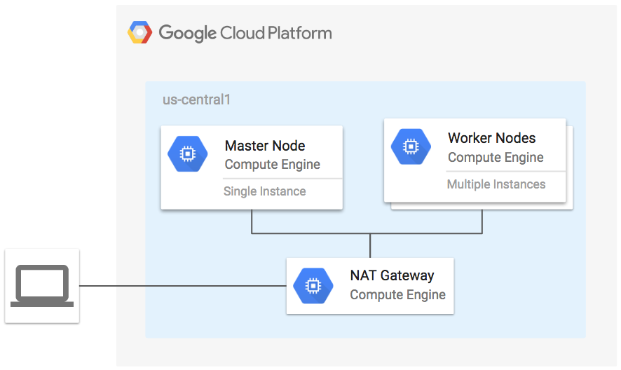

# Kubernetes Cluster on GCE Example

**Figure 1.** *diagram of Google Cloud resources*



## Set up the environment

```
gcloud auth get-default-application-credentials
export GOOGLE_PROJECT=$(gcloud config get-value project)
```

## Run Terraform

```
terraform init
terraform plan
terraform apply
```

SSH into master through the nat gateway

```
gcloud compute ssh --ssh-flag="-A" \
  $(gcloud compute instances list --filter=nat-gateway-us-central --uri) \
  -- ssh $(gcloud compute instances list --filter='name~k8s-.*master.*' --format='get(name)')
```

Configure kubectl:

```
mkdir -p $HOME/.kube
sudo cp -i /etc/kubernetes/admin.conf $HOME/.kube/config
sudo chown $(id -u):$(id -g) $HOME/.kube/config
```

Wait for all nodes to join and become Ready:

```
kubectl get nodes -o wide
```

## Cleanup

Remove all resources created by terraform:

```
terraform destroy
```
