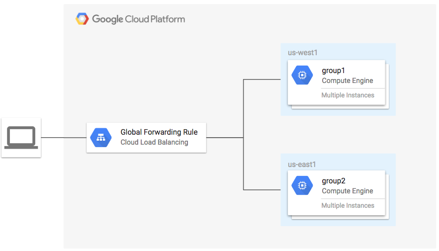

# HTTP Load Balancer Example

**Figure 1.** *diagram of Google Cloud resources*


## Setup Environment

```
export GOOGLE_CREDENTIALS=$(cat ~/.config/gcloud/service_account.json)
export GOOGLE_PROJECT=$(gcloud config get-value project)
export TF_VAR_region=YOUR_REGION
```

> See also: [Creating a Terraform Service Account](https://www.terraform.io/docs/providers/google/index.html#authentication-json-file).

## Run Terraform

```
terraform get
terraform plan
terraform apply
```

Open URL of load balancer in browser:

```
EXTERNAL_IP=$(terraform output -module gce-lb-http | grep external_ip | cut -d = -f2 | xargs echo -n)
open http://${EXTERNAL_IP}
```

> Wait for all instance to become healthy per output of: `gcloud compute backend-services get-health group-http-lb-backend-0 --global`

You should see the instance details from the region closest to you.

### Test balancing to other region

Resize the instnace group of your closest region to cause traffic to flow to the other group.

If you are getting traffic from `group1` (us-west1) from `http://${EXTERNAL_IP}`, scale group 1 to 0 instances:

```
TF_VAR_group1_size=0 terraform apply
```

> As of v0.9.11, this does not work. Waiting for [PR #65](https://github.com/terraform-providers/terraform-provider-google/pull/65).

Otherwise scale group 2 (us-east1) to 0 instances:

```
TF_VAR_group2_size=0 terraform apply
```

Open the external IP again and verify you see traffic from the other group:

```
open http://${EXTERNAL_IP}
```

> It may take several minutes for the global load balancer to be created and the backends to register.

## Cleanup

Remove all resources created by terraform:

```
terraform destroy
```