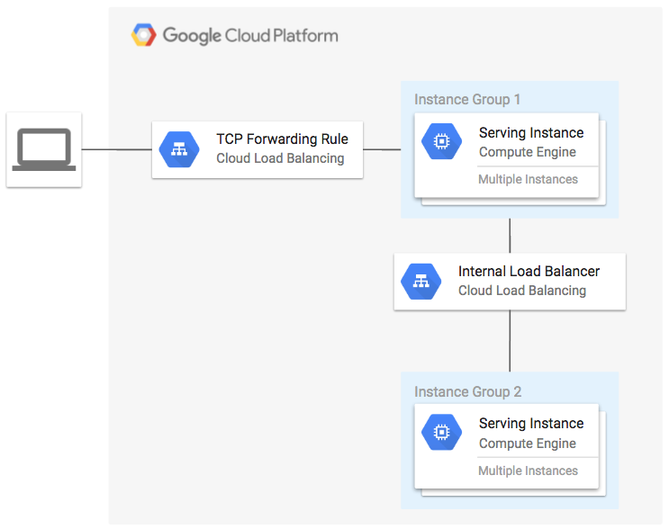

# Internal Load Balancer Example

**Figure 1.** *diagram of Google Cloud resources*


## Set up the environment

```
export GOOGLE_CREDENTIALS=$(cat ~/.config/gcloud/service_account.json)
export GOOGLE_PROJECT=$(gcloud config get-value project)
export TF_VAR_region=YOUR_REGION
```

## Run Terraform

```
terraform get
terraform plan
terraform apply
```

Open URL of load balancer in browser:

```
EXTERNAL_IP=$(terraform output -module gce-lb-fr | grep external_ip | cut -d = -f2 | xargs echo -n)
open http://${EXTERNAL_IP}
```

You should see the instance details from `group2` proxied through `group1` and the internal load balancer.