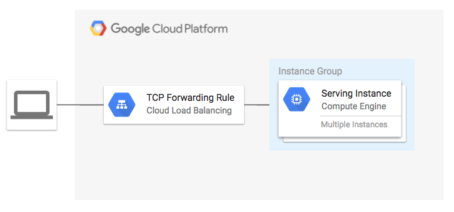

# TCP Forwarding Rule Example

**Figure 1.** *diagram of Google Cloud resources*


## Set up the environment

```
export GOOGLE_CREDENTIALS=$(cat ~/.config/gcloud/service_account.json)
export GOOGLE_PROJECT=$(gcloud config get-value project)
export TF_VAR_region=YOUR_REGION
```

> See also: [Creating a Terraform Service Account](https://www.terraform.io/docs/providers/google/index.html#authentication-json-file).

## Run Terraform

```
terraform get
terraform plan
terraform apply
```

Open URL of load balancer in browser:

```
EXTERNAL_IP=$(terraform output -module gce-lb-fr | grep external_ip | cut -d = -f2 | xargs echo -n)
open http://${EXTERNAL_IP}
```

You should see the instance details from `group1`

## Cleanup

Remove all resources created by terraform:

```
terraform destroy
```